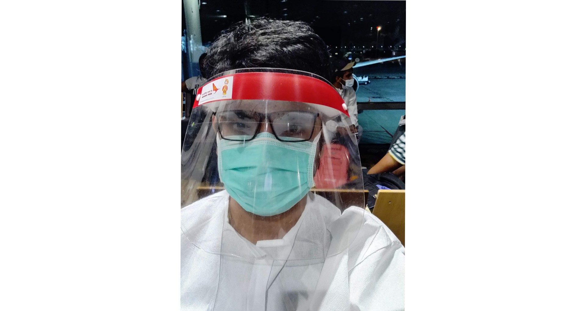

After 6 unforgettable years in Singapore, I was ready to start a new adventure in London. But as COVID struck, my plan to immigrate to the UK had to be shelved. With cases on the rise in the UK, I was relieved to be in Singapore. That was until I was asked to leave. As I had already resigned from my job in Singapore, my Singapore visa expired. And as I could not travel to the UK, my UK visa expired too since I didn't activate it. Singapore government graciously extended my visa for two months, allowing more time to weather the COVID crisis. But I eventually got a call from Indian Embassy asking me to book a repatriation flight to India. Here is an account of how it was -

## Buying a ticket
I got an email from the Indian embassy asking me to visit the airline's office at 2 pm the next day to purchase ticket for a repatriation flight. Knowing how the Indian system work, I reached around 12.30 pm to get a ticket. There were few people in the office and I got a ticket within minutes. They had a list of names and were only giving tickets to the people on the list.  I think had I reached the office on time (2 pm) I might not have got the ticket since the flight was full.

## Check-in
After saying goodbyes I reached the airport 4 hours before the flight (as mentioned in my ticket). Instead of directly queuing at the check-in counter, I was handed over some declaration forms and a slip that mentioned the time I am allowed to check-in.

Since my check-in time was still an hour away, I made a few calls and clicked some pictures to pass the time. Then came my turn and it took less than 5 minutes to check-in and I was sent to another queue. Here Indian embassy officials took the declaration form and allowed us to move to immigration.

## Immigration
Immigration at Singapore was pretty standard, I went to the Immigration official handed over my passport. She looked at it, stamped it and off I go.

## Waiting Area
Singapore airport is the best airport in the world. The one thing I missed during this trip was the water. All the water outlets were closed to prevent the spread of COVID, so I had to buy the overpriced bottle from the lone shop that was available.

## Security
Like any other trip, people formed a long queue at security.  Security followed the standard procedure. Take out your jackets, laptops etc. a quick check and guard allowed me to go. Everyone at
security was wearing masks and wearing suits.

## Holding Area
This is where you start to get the feeling that it's not going to be a normal flight. You can see a lot of people wearing gloves, suits etc (mask was compulsory). Airline officials gave everyone mask, face shield and some tissues. They handed out extra suits to some of us as well.

Then came the announcement and we started boarding.

## Flight
Flight was full. Airlines required everyone to wear the masks and face shield at all times. Food was packed and kept on every seat, though few passengers ate it. It was a night flight, but sleeping with a mask and face shield was next to impossible. Flight entertainment was turned off as well.

## Arrival
All the norms of social distancing were gone once the flight landed at Delhi airport. As usual people formed queues to get out of the plane standing close to each other.

Officials asked us to sit in a holding area for briefing and filling health declarations.

## Health Check and Briefing
They ask us to queue up at the 3 counters for the health check, which was basically just temperature screening. Officials at the airport tried their best to maintain social distancing. We were then  asked to go to a special holding area according to our state. I went to "Haryana, Punjab and Rajasthan" holding area.

## Grouping, Immigration and Baggage
The officials took our passport and put a sticker with a number, dividing us into groups of 30 each. We were told that all other formalities will happen group wise. Officials first took us to  immigration and then baggage collection making sure all the social distancing norms were followed. Protocols and arrangements were impressive. Our passports were now taken away in a bag and were again asked to go to individual state counters.

## Haryana State Counter
At the counter, A district-specific form (Gurugram in my case) was given to me. I was handed over my passport as well. There was one CRPF (central police) officer at the exit, who only allowed people out after confirmation from state officials. I filled the form and waited for my turn. A lot of people kept breaking the queue despite several pleas from the officials. I went in and was asked to select a hotel for 7 days or a government-sponsored quarantine facility. I asked if I can do home quarantine which was politely declined. I chose my hotel and was then asked to present a proof of my Gurugram residency. I contacted my brother to get the residency proof after which I was allowed to leave.

## Exit
At the exit, CRPF official still didn't allow me to leave asking me to bring state official personally. So I did and was finally allowed to exit. Just outside several cab drivers offered me to drive to the hotel which is like less than 8 km for Rs. 2000 - Rs. 4000, normal price is Rs. 300. I took a pre-paid cab which cost me 600 Rs and the person didn't give me any receipt. After 4 hours at the airport, I was in no mood for an argument.

## Hotel
Cab driver sanitized his car and drove me to the hotel. I was given a room for 7 days at Govt. subsidized rate of Rs. 3000 including food which is pretty decent for 4-star hotel. I was asked not to come out of the room for the next 7 days and a COVID test was arranged for me on 6th day after which I was allowed to leave.

These are challenging times. I will not forget about this journey for a long time. Stay at home, stay safe.